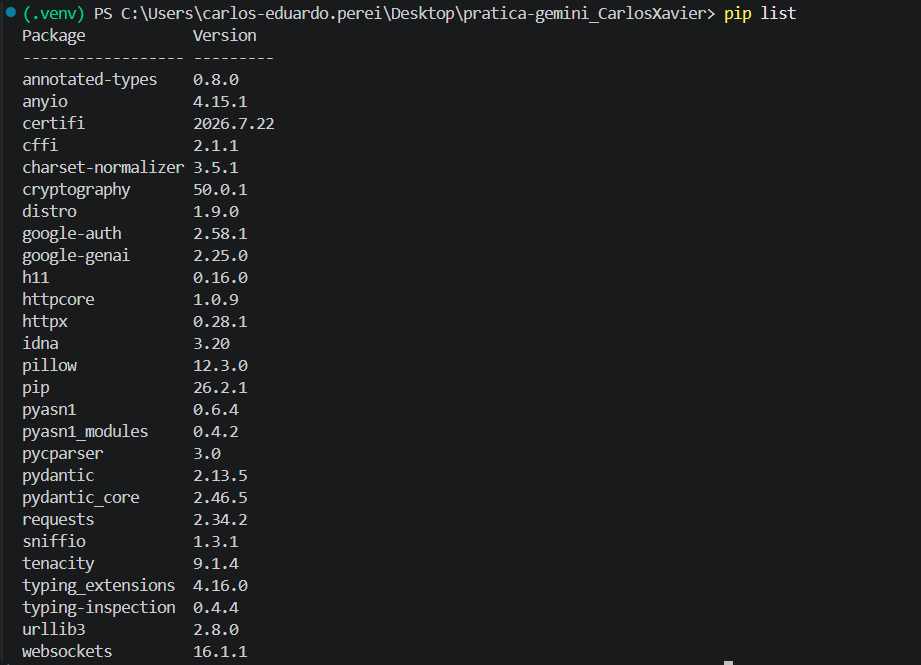
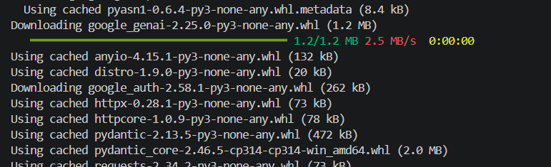
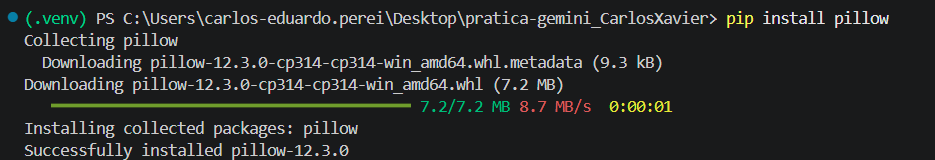
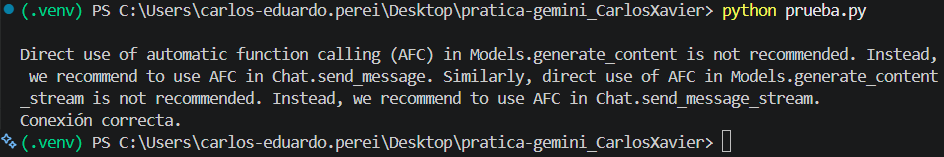
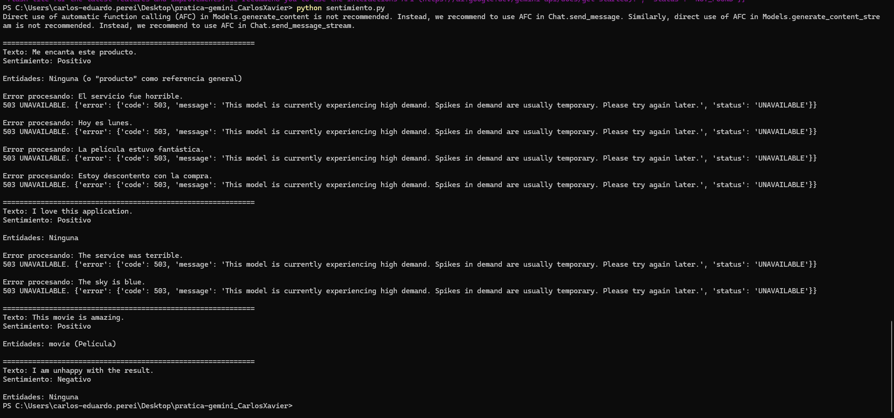
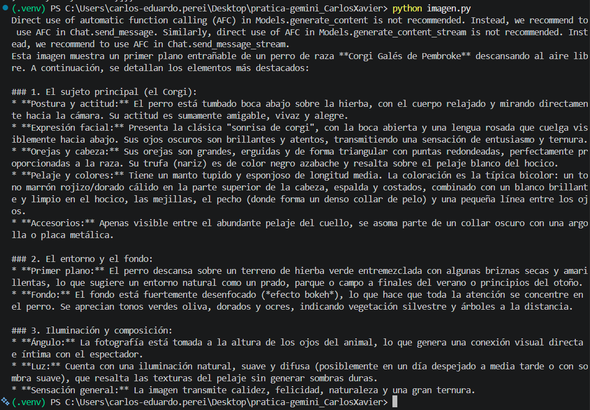

# Práctica Google AI Studio y Gemini API

## Autor

Carlos Eduardo Xavier Pereira

---

# Objetivo de la práctica

El objetivo de esta práctica es aprender a utilizar Google AI Studio y la API de Gemini desde Python, realizando pruebas de generación de texto, análisis de sentimiento y análisis multimodal de imágenes.

---

# Herramientas utilizadas

- Google AI Studio
- API de Gemini
- Python 3.14
- VS Code
- Librería google-genai
- Librería Pillow



---

# Instalación

Instalar las dependencias necesarias:

```bash
pip install google-genai
pip install pillow
```



---

# Configuración

2. Crear una API Key.
3. Guardar la API Key.
4. Configurar la clave dentro del código Python.

Ejemplo:

```python
from google import genai

client = genai.Client(api_key="TU_API_KEY")
```

---

# Prueba de conexión con Gemini

Se creó un script en Python para comprobar la conexión con la API.

El resultado fue satisfactorio, obteniendo respuestas generadas por Gemini de forma correcta.



---

# Análisis de sentimiento

## Objetivo

Analizar diferentes textos en español e inglés para identificar:

- Sentimiento positivo.
- Sentimiento negativo.
- Sentimiento neutro.
- Entidades mencionadas.

## Textos analizados

### Español

- Me encanta este producto.
- El servicio fue horrible.
- Hoy es lunes.
- La película estuvo fantástica.
- Estoy descontento con la compra.

### Inglés

- I love this application.
- The service was terrible.
- The sky is blue.
- This movie is amazing.
- I am unhappy with the result.

## Resultados obtenidos

Gemini fue capaz de clasificar correctamente los sentimientos de los textos procesados.

Ejemplos:

| Texto | Sentimiento |
|---------|---------|
| Me encanta este producto | Positivo |
| I love this application | Positivo |
| This movie is amazing | Positivo |
| I am unhappy with the result | Negativo |

Durante algunas ejecuciones se recibieron respuestas de error temporal (503 UNAVAILABLE) debido a alta demanda en los servidores de Gemini.



---

# Análisis multimodal de imágenes

## Objetivo

Utilizar Gemini para analizar una imagen enviada desde Python y generar una descripción detallada de su contenido.

## Procedimiento

1. Se cargó una imagen utilizando Pillow.
2. La imagen se envió a Gemini mediante la API.
3. Se solicitó una descripción detallada del contenido, en ese caso una imagen.

    - Imagen que se utiliza para pedir la descripción detallada:
    


## Resultado

Gemini identificó correctamente:

- La presencia de un perro de raza Corgi.
- El entorno natural donde se encontraba.
- La iluminación de la escena.
- Los colores predominantes.
- La composición fotográfica.

La descripción generada fue completa y precisa.



---

# Conclusiones

Durante esta práctica se ha aprendido a:

- Utilizar Google AI Studio.
- Crear y gestionar una API Key.
- Conectar aplicaciones Python con Gemini.
- Realizar análisis de sentimiento en distintos idiomas.
- Procesar contenido multimodal mediante imágenes.
- Obtener respuestas generadas mediante Inteligencia Artificial.

Los objetivos de la práctica se han cumplido satisfactoriamente y se ha comprobado el correcto funcionamiento de la API de Gemini en diferentes escenarios.